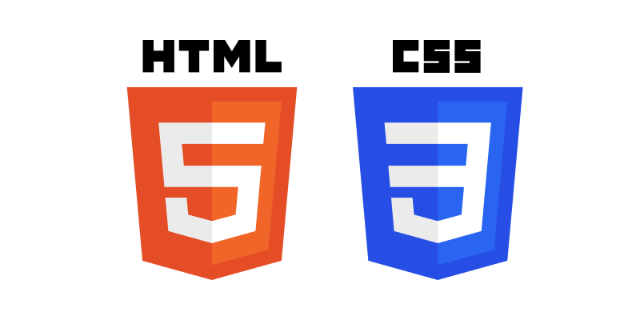
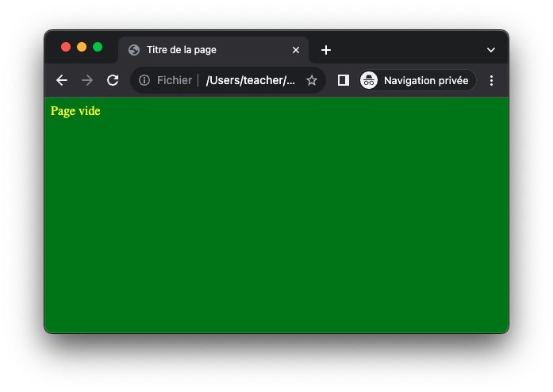

# Création d'une page web

## Introduction



Ces travaux pratiques consistent à revoir les langages HTML et CSS vus en SNT.
Pour celà, vous devrez créer une page web en utilisant un certain nombre de balises HTML et la mettre en forme en
utilisant le langage CSS.

!!! success "Objectifs"

    - vérifier le bon fonctionnement de votre ordinateur portable   
    - mesurer votre maîtrise des outils numériques (ordinateur et logiciels)
    - mesurer votre capacité à suivre des consignes
    - mesurer vos compétences en programmmation

## Préparation

### Espace de travail

Afin vos productions numériques ne soient pas mélangées entre les différentes matières et travaux pratiques,
vous allez créer des dossiers afin de les organiser.

!!! note "Organisation de l'espace travail"

    === "Ordinateur portable"

        1. Lancez l'**explorateur de fichiers**
        2. Accédez au dossier **Documents**
        3. Créez un dossier nommé **NSI**
        4. Dans le dossier **NSI**, créez un dossier nommé **chapitre_01**

    === "Ordinateur fixe"

        1. Depuis le bureau, double-cliquez sur l'icône intitulée **Zone personnelle**
        2. Dans votre zone personnelle, créez un dossier nommé **NSI** s'il n'existe pas
        3. Dans le dossier **NSI**, créez un dossier nommé **chapitre_01**

### Création d'une page vide

Pour commencer, vous allez créer une page web vide à partir du code HTML suivant :

```html
<!doctype html>
<html lang="fr">
<head>
    <meta charset="utf-8">
    <title>Titre de la page</title>
</head>
<body>
Page vide
</body>
</html>
```

!!! note "Création de la page web"

    1. Créez un fichier nommé `index.html` dans le dossier `chapitre_01` créé précédement 
    2. Copiez-y le code HTML ci-dessus
    3. Ouvrez le fichier `index.html` dans un navigateur web

### Création de la feuille de style

Vous allez maintenant créer une feuille de style à lier à votre page web à partir du code CSS suivant :

```css
body {
    background: green;
    color: yellow;
}
```

!!! note "Création de la feuille de style"

    1. Créez un fichier nommé `style.css` dans le même dossier que `index.html` 
    2. Copiez-y le code CSS ci-dessus
    3. Liez la feuille de style à la page web en ajoutant la ligne ci-dessous entre les balises  `#!html <head></head>` du fichier `index.html`:<br />
      `#!html <link rel="stylesheet" href="style.css">`
    4. Ouvrez ou rafraichissez la page `index.html` dans un navigateur web

??? success "Résultat attendu"

    

## Application

### Balises de base

Voici quelques balises à tester avec les contenus de votre choix :

| Balise                         | Fonction                         |
|:-------------------------------|:---------------------------------|
| `#!html <h1>...</h1>`          | Titre niveau 1                   |
| `#!html <h2>...</h2>`          | Titre niveau 2 (sous-titre)      |
| `#!html <h3>...</h3>`          | Titre niveau 3 (sous-sous-titre) |
| `#!html <p>...</p>`            | Paragraphe                       |
| `#!html <strong>...</strong>`  | Gras                             |
| `#!html <em>...</em>`          | Italique                         |
| `#!html ` | Image                            |
| `#!html <a href="url">...</a>` | Lien hypertexte                  |
| `#!html <table></table>`       | Tableau                          |
| `#!html <ul><li></li></ul>`    | Liste à puces                    |
| `#!html <ol><li></li></ol>`    | Liste numérotée                  |

## Ressources

Voici quelques ressources qui vous permettront d'approfondir vos connaissances et de mettre en œuvre des pages plus
audacieuses :

- [Mozilla - Introduction au HTML](https://developer.mozilla.org/fr/docs/Learn/HTML/Introduction_to_HTML/Getting_started){:target="_blank"}
- [Mozilla - Bases du HTML](https://developer.mozilla.org/fr/docs/Learn/Getting_started_with_the_web/HTML_basics){:target="_blank"}
- [Mozilla - Bases du CSS](https://developer.mozilla.org/fr/docs/Learn/Getting_started_with_the_web/CSS_basics){:target="_blank"}
- [W3Schools - Cours HTML](https://www.w3schools.com/html/){:target="_blank"}
- [W3Schools - Cours CSS](https://www.w3schools.com/css/){:target="_blank"}
- [W3C - Liste de toutes les balises](https://www.w3.org/TR/2012/WD-html-markup-20121025/elements.html){:target="_blank"}