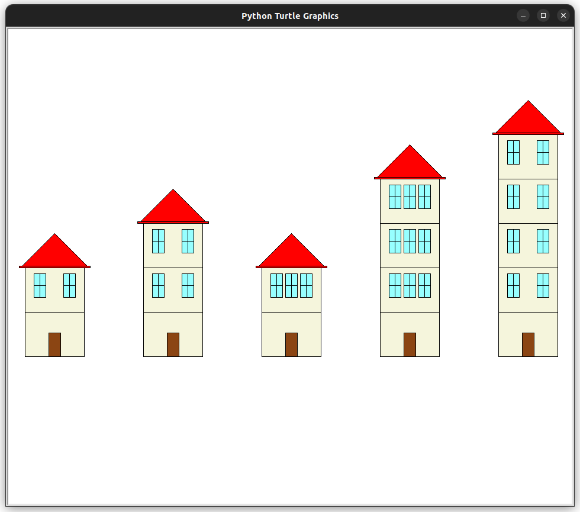

# Génération d'un paysage aléatoire

## Objectif
Le projet consiste en la génération d'un paysage urbain aléatoire.
Ce paysage sera construit à partir d'un unique élément paramétrable. 

## L'élément
L'élément paramétrable à dessiner est une **habitation**. Celle-ci peut varier de diverses façons :

- Le nombre d'étages
- La forme du toit
- La taille du toit
- La présence de balcons à certaines fenêtres
- La présence de jardinières à certaines fenêtres
- La présence de paraboles
- La couleur de la façade
- La couleur du toit
- ...

Les paramètres doivent donc permettre d'ajuster le tracé de l'objet et potentiellement ses couleurs.

### Nombre de paramètres
Le nombre de paramètres attendus, indépendamment des paramètres de positionnement, est de six (quatre paramètres de tracé et deux paramètres de couleur).
C'est un critère d'évaluation. Vous pouvez en implémenter moins, mais la note maximale sera ajustée en conséquence.
Voici les configurations de paramètres envisageables triées par difficulté décroissante.

1. Une habitation à quatre paramètres de tracé et deux paramètres de couleur
2. Une habitation à quatre paramètres de tracé
3. Une habitation à deux paramètres de tracé et deux paramètres de couleur
4. Une habitation à deux paramètres de tracé

### Exemple d'habitation à deux paramètres
L'objet que nous souhaitons dessiner est une maison.
Le tracé de celle-ci peut être ajusté selon deux paramètres qui sont le nombre d'étages et le nombre de fenêtres par étage.

```python
def maison(x, y, nb_etages, nb_fenetres):
    """
    Dessine une maison
    
    x           -- position x du coin inférieur gauche
    y           -- position y du coin inférieur gauche
    nb_etages   -- nombre d'étages
    nb_fenetres -- nombre de fenêtres par étage
    """
```

Voici un exemple de paysage construit à partir de plusieurs appels d'une fonction de tracé d'une habitation à deux paramètres :

```python
def dessiner_paysage():
    """
    Dessine le paysage de la ville
    """
    maison(-450, -150, 1, 2)
    maison(-250, -150, 2, 2)
    maison(-50,  -150, 1, 3)
    maison(150,  -150, 3, 3)
    maison(350,  -150, 4, 2)
```

<figure markdown>

</figure>

## Livrable

Votre projet devra être transmis à l'enseignant au format zip. Le code Python devra être séparé en deux modules minimum.
Un ou plusieurs modules contiendront la définition de vos fonctions de tracé et idéalement du code de test.
Un module appelé `main.py` contiendra la configuration Turtle et l'appel à la fonction de tracé du paysage.

### Exemple de fichier `main.py`

```python
import turtle            # Module turtle
import ville             # Nom arbitraire du module contenant les fonctions de dessin

turtle.hideturtle()      # Masque la tortue
turtle.tracer(1, 0)      # Accélère le tracé
ville.dessiner_paysage() # Génère le paysage aléatoire 
turtle.done()            # Boucle des événements
```

## Critères d'évaluation

- Envoi du projet dans les temps
- Respect des contraintes
- Qualité du code
- Qualité des algorithmes
- Qualité du découpage en fonctions
- Présence de commentaires
- DocStrings pour chaque fonction
- Bonus artistique (si tous les points relatifs à la programmation sont respectés)

!!! info Conseil

    Ne vous précipitez pas immédiatement sur vos ordinateurs. Préparez vos tracés et vos algorithmes sur papier.
