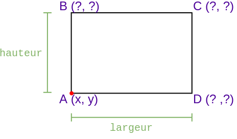
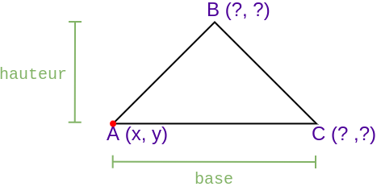
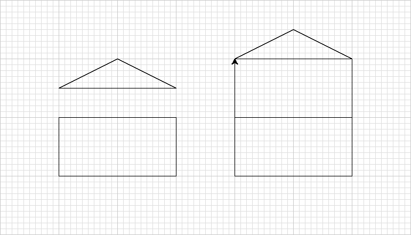
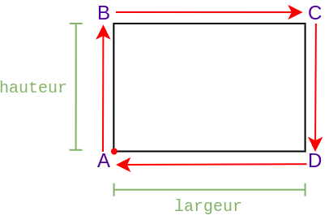
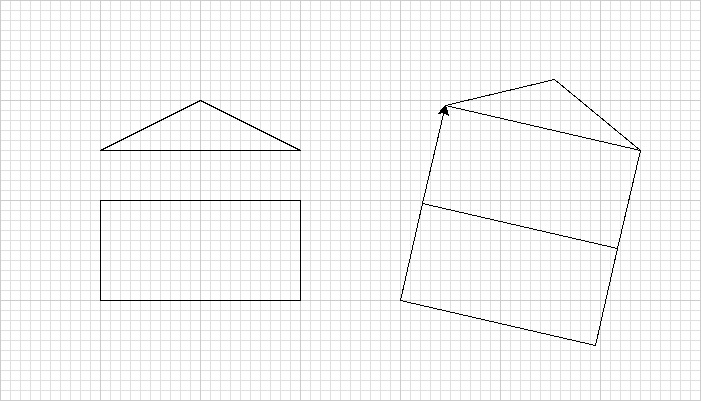

# Méthodes de tracé

## Introduction

Dans le cadre de ces travaux pratiques, nous allons étudier deux méthodes de tracé sous Turtle.
La première méthode, que nous appellerons *tracé absolu*, consiste à effectuer les tracés uniquement sur la base des
coordonnées de points dans le plan.

La seconde méthode, que nous appellerons *tracé relatif*, consiste à effectuer les tracés uniquement sur la base des
déplacements et de l'orientation de la tortue.

## Préparation

### Espace de travail

Vous allez créer des dossiers afin de ne pas mélanger vos productions numériques entre vos différentes matières et
travaux pratiques.

!!! note "Organisation de l'espace travail"

    === ":material-laptop: Ordinateur portable"

        1. Lancez l'application <i class="icon file-explorer"></i> **Explorateur de fichiers** 
           <span class="keys shortcut"><kbd>:fontawesome-brands-windows:</kbd><span>+</span><kbd>E</kbd></span>
        2. Accédez à votre dossier <i class="icon onedrive"></i> **OneDrive**
        3. Dans le dossier `OneDrive`, s'il n'y a pas de dossier `NSI`, créez-le
        4. Dans le dossier `NSI`, créez le dossier `chapitre_04`
        5. Dans le dossier `chapitre_04` créez `tp1_methodes_tracé`

    === ":material-desktop-tower: Ordinateur fixe"

        1. Depuis le bureau, double-cliquez sur l'icône intitulée **Zone personnelle**
        2. Dans la **zone personnelle**, s'il n'y a pas de dossier `NSI`, créez-le
        3. Dans le dossier `NSI`, créez un dossier nommé `chapitre_04`
        4. Dans le dossier `chapitre_04` créez `tp1_methodes_tracé`

### Téléchargement

Pour réaliser ces travaux pratiques, il est nécessaire de disposer de certains fichiers.

!!! note "Récupération des fichiers"

    1. Téléchargez le fichier ZIP contenant les fichiers nécessaires : [:material-download: télécharger](assets/NSI1RE04_TP1.zip){:download="NSI1RE04_TP1.zip"}
    2. Ouvrez le fichier ZIP<br>*(si le navigateur ne l'ouvre automatiquement, cliquez sur le fichier téléchargé)*
    3. Sélectionnez tous les fichiers et dossiers  <span class="shortcut">++ctrl+a++</span>
    4. Copiez tous les fichiers et dossiers <span class="shortcut">++ctrl+c++</span>
    5. Collez les fichiers dans le dossier `NSI\chapitre_04\tp1_methodes_tracé` <span class="shortcut">++ctrl+v++</span>

## Tracé absolu

!!! info "Principe"

    - Basé sur les coordonnées *(x,y)* de chaque point du tracé
    - Effectuer les tracés **uniquement** à l'aide de la fonction `goto()`

### Démarrage

!!! note "Mise en pratique"

    - Lancez l'application **Thonny**
    - Ouvrez le fichier `paysage_absolu.py`
    - Observez le code source

Le fichier contient la définition de 4 procédures :

- `#!python mur()`
- `#!python toit()`
- `#!python maison()`
- `#!python dessiner_paysage()`

Pour rappel, une **procédure** désigne une fonction ne renvoyant aucune valeur.
Ces procédures sont en charge d'un tracé allant du plus spécifique avec les éléments `#!python mur()`
et `#!python toit()`, au plus
général avec `#!python dessiner_paysage()`.

Chaque procédure dispose d'une *Docstring* décrivant le comportement attendu et le rôle de chaque paramètre.

Les procédures `#!python mur()` et `#!python toit()` ne disposent que des commandes de positionnement de la tortue, mais
pas des commandes du tracé. Les procédures `#!python maison()` et `#!python dessiner_paysage()` ne disposent que de
l'instruction `#!python pass`. Au fil des exercices, le travail consistera à remplacer les instructions `#!python pass`
par du code Python répondant aux spécifications de chaque *Docstring*.

!!! info "L'instruction `#!python pass`"

    L'instruction `pass` est spécifique au langage Python et signifie *« ne rien faire »*.
    Elle est généralement utilisée pour signaler des blocs de code à écrire et ainsi éviter que l'interpréteur ne signale
    une erreur. En effet, il n'est pas autorisé en Python de définir une fonction vide.

### Test d'un module

Vous remarquerez en fin de fichier les lignes suivantes :

```python
if __name__ == "__main__":
    mur(0, 0, 200, 100)
    toit(-300, 0, 200, 100)
    turtle.mainloop()
```

Mais quelle est la finalité l'expression `#!python __name__ == "__main__"` ?
Il faut savoir que Python définit une variable `#!python  __name__` automatiquement pour chaque module.
Il existe deux situations possibles :

!!! info "Situation 1 - Lancement du programme depuis `paysage_absolu.py`"

    Si un fichier `.py` est utilisé comme point de départ du programme, alors la variable `__name__` aura pour valeur
    la chaîne de caractères `#!python "__main__"`.

    Ainsi, lorsqu'on lance l'interpréteur Python à partir du fichier `paysage_absolu.py`, la valeur de `__name__` à
    l'intérieur du module `paysage_absolu.py` sera `#!python "__main__"`. Exemple :

    === ":material-file-outline: `paysage_absolu.py`"
        
        ```python
        print(__name__)
        if __name__ == "__main__":
            print("Exécution code paysage absolu")
        ```

    === ":material-console: Console"
        
        ```
        > python paysage_absolu.py
        __main__
        Exécution code paysage absolu
        ```

!!! info "Situation 2 - Import du fichier `paysage_absolu.py`"

    Si un fichier `.py` est importé en tant que module, alors la variable `__name__` aura pour valeur sera le nom du module importé.
    
    Ainsi, si on importe `paysage_absolu`, la valeur de `__name__` à l'intérieur de `paysage_absolu.py` sera `#!python "paysage_absolu"`. Exemple :


    === ":material-file-outline: `main.py`"

        ```python
        import paysage_absolu

        print("Exécution code main")
        ```


    === ":material-file-outline: `paysage_absolu.py`"
        
        ```python
        print(__name__)
        if __name__ == "__main__":
            print("Exécution du code")
        ```

    === ":material-console: Console"
        
        ```
        > python main.py
        paysage_absolu
        Exécution code main
        ```

Dans le cadre de ces travaux pratiques, le point de départ du programme final sera le fichier `main.py` d'où sera
importé `paysage_absolu`.
Mais avant d'en arriver là, nous souhaiterions disposer de tests des fonctions du module `paysage_absolu`.
C'est le rôle de ces quelques lignes à la fin du fichier `paysage_absolu.py`.

### Factorisation

La portion de code ci-dessous permet de positionner la tortue aux coordonnées *(x, y)* :

```python
turtle.pu()
turtle.goto(x, y)
turtle.pd()
```

Ce code étant utilisé à plusieurs reprises, il serait judicieux de le factoriser. Créez la
procédure `#!python positionner()`
ayant deux paramètres `x` et `y` correspondant aux nouvelles coordonnées de la tortue.

### Tracé des sous-parties

<h4>Tracé d'un mur</h4>

Implémentez la procédure `#!python mur()`. Pour cela, il est nécessaire d'identifier les opérations nécessaires au
calcul des
coordonnées des points *A*, *B*, *C* et *D*.

!!! info "Conseil"

    La *Docstring* précise que les paramètres `x` et `y` correspondent aux coordonnées du coin inférieur gauche du mur, donc le point *A*.
    Déduire les coordonnées des autres points par rapport au point *A* en utilisant les paramètres `hauteur` et `largeur`.

    <figure markdown>
        
    </figure>

<h4>Tracé d'un toit</h4>

Implémentez la procédure `toit()`. Pour cela, il est nécessaire d'identifier les opérations nécessaires au calcul des
coordonnées des points *A*, *B*, *C*.

!!! info Conseil

    La *Docstring* précise que les paramètres `x` et `y` correspondent aux coordonnées du coin inférieur gauche du toit, donc le point *A*.
    Déduire les coordonnées des autres points par rapport au point *A* en utilisant les paramètres `hauteur` et `base`.

    <figure markdown>
        
    </figure>

### Tracé de la maison

<h4>Tracé d'une maison</h4>

Compléter la procédure `maison()` en suivant la description donnée par la *Docstring* et en utilisant les
procédures `mur()` et `toit()`.

<h4>Tracé paramétrable d'une maison</h4>

Modifier la procédure `maison()` de façon à pouvoir passer en argument le nombre d'étages de la maison grâce au
paramètre `etage`.
Ci-dessous le rendu généré par les tests avec le rendu d'une maison à deux étages.

<figure markdown>

</figure>

### Tracé du paysage

Compléter la procédure `dessiner_paysage()` en suivant la description donnée par la *Docstring*.
Les tests de cette procédure devront cette fois s'effectuer depuis le fichier `main.py`.

## Tracé relatif

!!! info "Tracé relatif"

    - Basé sur les déplacements et l'orientation de la tortue
    - Effectuer les tracés **uniquement** à l'aide des fonctions `forward()`, `backward()`, `left()`, `right()`

!!! danger "Attention"

    À la fin du tracé de chaque forme, vous devez vous assurer que la tortue retrouve **la même position et la même
    orientation** qu'au départ du tracé.

### Démarrage

!!! note "Mise en pratique"

    - Lancez l'application **Thonny**
    - Ouvrez le fichier `paysage_relatif.py`
    - Observez le code source

Le fichier contient la définition de 4 procédures :

- `mur()`
- `toit()`
- `maison()`
- `dessiner_paysage()`

Vous remarquerez que cette fois, les procédures `mur()`, `toit()` et `maison()` ne disposent pas des paramètres `x`
et `y`.
C'est parce que le tracé se fait depuis la position courante de la tortue en utilisant **uniquement** les
fonctions `forward()`, `backward()`, `left()`, `right()`

### Tracé des sous-parties

<h4>Tracé d'un mur</h4>

Implémentez la procédure `mur()`. Pour cela, il est nécessaire d'identifier les mouvements de la tortue nécessaires pour
effectuer le tracé.

<figure markdown>

</figure>

<h4>Tracé d'un toit</h4>

Implémentez la procédure `toit()`. Pour cela, il est nécessaire d'identifier les mouvements de la tortue nécessaires
pour
effectuer le tracé.
Certaines longueurs et certains angles de rotation devront être calculé. Un commentaire a été ajouté pour vous aider
ainsi que du code à compléter.

```python
#    B
#   /|\
#  / | \
# /  |  \
# A--C--D
#
# *** Longueurs ***
# AC       = base/2
# BC       = hauteur
# AB²      = AC² + BC²
#
# *** Angles ***
# tan(ABC) = AC/BC
# BAC      = 180-90-ABC
# ABD      = 2 * ABC
```

### Tracé de la maison

<h4>Tracé d'une maison</h4>

Compléter la procédure `#!python maison()` en suivant la description donnée par la *Docstring* et en utilisant les
procédures `#!python mur()` et `#!python toit()`.

<h4>Tracé paramétrable d'une maison</h4>

Modifier la procédure `#!python maison()` de façon à pouvoir passer en argument le nombre d'étages de la maison grâce au
paramètre `etage`. Ci-dessous le rendu généré par les tests avec le rendu d'une maison à deux étages.

<figure markdown>

</figure>

### Tracé du paysage

Compléter la procédure `dessiner_paysage()` en suivant la description donnée par la *Docstring*.
Les tests de cette procédure devront cette fois s'effectuer depuis le fichier `main.py`.