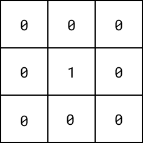
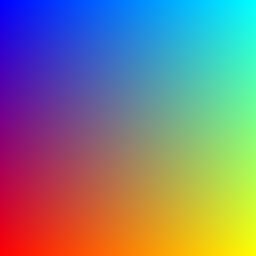

# Les images

## Introduction

Ces travaux pratiques ont pour objectif de vous faire manipuler des tableaux à deux dimensions dans le cadre de la
création d'images.

## Préparation

### Espace de travail

Vous allez créer des dossiers afin de ne pas mélanger vos productions numériques entre vos différentes matières et
travaux pratiques.

!!! note "Organisation de l'espace travail"

    === ":material-laptop: Ordinateur portable"

        1. Lancez l'application <i class="icon file-explorer"></i> **Explorateur de fichiers** 
           <span class="keys shortcut"><kbd>:fontawesome-brands-windows:</kbd><span>+</span><kbd>E</kbd></span>
        2. Dans le dossier `Document`, s'il n'y a pas de dossier nommé `NSI`, créez-le
        4. Dans le dossier `NSI`, s'il n'y a pas de dossier `chapitre_06`, créez-le
        5. Dans le dossier `chapitre_06` créez le dossier `tp2`

    === ":material-desktop-tower: Ordinateur fixe"

        1. Depuis le bureau, double-cliquez sur l'icône intitulée **Zone personnelle**
        2. Dans la **zone personnelle**, s'il n'y a pas de dossier `NSI`, créez-le
        3. Dans le dossier `NSI`, s'il n'y a pas de dossier `chapitre_06`, créez-le
        4. Dans le dossier `chapitre_06` créez le dossier `tp2`

### Téléchargement

Pour réaliser ces travaux pratiques, il est nécessaire de disposer de certains fichiers.

!!! note "Récupération des fichiers"

    1. Téléchargez le fichier ZIP contenant les fichiers nécessaires : [:material-download: télécharger](assets/NSI1RE06_TP2.zip){:download="NSI1RE06_TP2.zip"}
    2. Ouvrez le fichier ZIP<br>*(si le navigateur ne l'ouvre automatiquement, cliquez sur le fichier téléchargé)*
    3. Sélectionnez tous les fichiers et dossiers  <span class="shortcut">++ctrl+a++</span>
    4. Copiez tous les fichiers et dossiers <span class="shortcut">++ctrl+c++</span>
    5. Collez les fichiers dans le dossier `NSI\chapitre_06\tp2` <span class="shortcut">++ctrl+v++</span>

## Pixel Art

### 1.1 Vérification

Afin de vérifier le bon fonctionnement du module `images`, suivre les instructions ci-après.

!!! note "Mise en pratique"

    1. Lancer l'application Thonny
    2. Créer un nouveau fichier
    3. Enregistrer le programme dans le fichier `partie1\ex1_test.py`
    4. importer le module `images`
    5. Appeler la fonction `#!python afficher_test()` du module `images`
    6. Lancer le programme

!!! warning "En cas de problème"

    <h5>PIL n'est pas installé</h5>

    1. Accéder au menu **Outils ▸ Gérer les paquets...** de Thonny
    2. Saisir **pillow** et cliquer sur **Rechercher sur PyPI**
    3. Cliquer sur **Pillow**
    4. Cliquer sur **Installer**

    <h5>PIL est installé mais ça ne fonctionne toujours pas</h5>
    1. Se connecter à [https://console.basthon.fr](https://console.basthon.fr)
    2. Cliquer sur l'icône *Ouvrir un script, charger un module ou un fichier*
    3. Charger le fichier `image.py`

!!! success "Résultat"

    <figure markdown>
        {:style="border:1px solid black;"}
    </figure>


### 1.2 Première image

Nous souhaitons afficher une image à partir d'un tableau à deux dimensions.

!!! note "Mise en pratique"

    1. Créer un nouveau fichier
    2. Enregistrer le programme dans le fichier `partie1\ex2_image.py`
    3. importer le module `images`
    4. Créer un tableau à deux dimensions `pixels` correspondant à la représentation suivante :

    <figure markdown>
        
    </figure>

!!! note "Mise en pratique"

    1. Appeler la fonction `afficher_image` du module `images` en lui passant la variable `pixels` en argument.
    2. Lancer le programme, l'affichage doit être le suivant :
    <figure markdown>
        {:style="border:1px solid black;"}
    </figure>

    3. Modifier les valeurs du tableau à deux dimensions `pixels` de façon à obtenir l'affichage suivant :
    <figure markdown>
        {:style="border:1px solid black;"}
    </figure>

### 1.3. Dessiner une bordure

Pour les images du précédent exercice, les pixels ont été choisis un par un manuellement.
Nous souhaitons maintenant définir les pixels d'une image vierge de taille quelconque.
Pour cela, il sera nécessaire d'automatiser la définition des pixels.

!!! note "Mise en pratique"

    1. Ouvrir le fichier `partie1\ex3_bordure.py`
    2. Créer un tableau à deux dimensions `pixels` aux dimensions de votre choix dont toutes les valeurs sont initialisées à zéro
    3. Compléter la procédure `afficher_dimensions` qui prend en paramètre un tableau à deux dimensions représentant une image, et qui affiche ses dimensions

    ```
    >>> pixels = [[0, 0, 0], [0, 0, 0]]
    >>> afficher_dimensions(pixels)
    3 x 2
    ```

    (*l'écriture de cette fonction à pour objectif d'avoir l'assurance que vous ayez bien distingué les lignes et les colonnes d'une image représentée par un tableau à deux dimensions*)

    4. Compléter la procédure `dessiner_bordure` prenant en paramètre un tableau à deux dimensions et affectant 1 aux
       éléments de façon à ajouter une bordure à l'image.
       Attention, cette procédure doit être capable de dessiner une bordure pour toute taille d'image (*pour rappel, une
       procédure est une fonction qui ne renvoie pas de valeur*)

    ```
    >>> pixels = [[0, 0, 0], [0, 0, 0], [0, 0, 0]]
    >>> dessiner_bordure(pixels)
    >>> pixels
    [[1, 1, 1], [1, 0, 1], [1, 1, 1]]
    ```
    
    5. Afficher l'image en utilisant la fonction `afficher_image`
    <figure markdown>
        
    </figure>


## Générer un tableau 2D

### 2.1. Affichage d'un tableau

Nous souhaitons disposer d'une procédure `afficher_tableau` ayant pour seul paramètre un tableau d'entiers `tableau`.
Cette procédure affiche le contenu de `tableau` de façon comparable à l'exemple suivant :

!!! example "Exemple"

    === ":material-console: Console Python"
    ```
    >>> afficher_tableau([2, 4, 6, 8])
    2 4 6 8
    ```

!!! note "Mise en pratique"

    1. Ouvrir le fichier `partie2\tableau.py`
    2. Compléter la procédure `afficher_tableau`
    3. Lancer les tests et corriger le code jusqu'à l'absence d'erreurs

### 2.2. Affichage d'un tableau 2D

Nous souhaitons disposer d'une procédure `afficher_tableau_2D` ayant pour seul paramètre un tableau à deux dimensions
d'entiers `tableau_2D`.
Cette procédure affiche le contenu de `tableau_2D` de façon comparable à l'exemple suivant :

```
>>> afficher_tableau_2D([[1, 2], [3, 4], [5, 6]])
1 2
3 4
5 6
```

!!! note "Mise en pratique"

    1. Revenir au fichier `partie2\tableau.py`
    2. Compléter la procédure `afficher_tableau_2D`. Faire appel à la procédure `afficher_tableau`
    3. Lancer les tests et corriger le code jusqu'à l'absence d'erreurs

### 2.3. Génération d'un tableau 2D

Nous souhaitons disposer d'une fonction `generer_tableau_2D` renvoyant un tableau à deux dimensions. Elle dispose des
paramètres suivants :

- `largeur` - Entier correspondant à la largeur du tableau (nombre de colonnes)
- `hauteur` - Entier correspondant à la hauteur du tableau (nombre de lignes)
- `valeur` - Valeur initiale des éléments du tableau

```
>>> test = generer_tableau_2D(5, 5, 0)
>>> test[2][2] = 1
>>> afficher_tableau_2D(test)
0 0 0 0 0
0 0 0 0 0
0 0 1 0 0
0 0 0 0 0
0 0 0 0 0
```

!!! note "Mise en pratique"

    1. Revenir au fichier `partie2\tableau.py`
    2. Compléter la procédure `generer_tableau_2D`.
    3. Lancer les tests et corriger le code jusqu'à l'absence d'erreurs

!!! tip Conseil
    
    Penser à utiliser les tableaux en compréhension ou l'opérateur `*`


## Image couleur

### Introduction

#### Les tuples

Un objet de type **tuple**, un **p-uplet**, est une suite ordonnée d'éléments pouvant être chacun de n'importe quel
type.
On parlera indifféremment de **p-uplet** ou de **tuple**. On p-uplet utilise comme enregistrement de données hétérogènes
liées entre elles.

```python
# Syntaxe
p_uplet = (valeur_1, ..., valeur_p)

# Utilisation d'un p-uplet pour stocker les informations d'un pixel
pixel = (255, 0, 0, 1.0)
```

#### La couleur

Une couleur est définie par 3 entiers compris entre 0 et 255 correspondant respectivement aux composantes rouge, vert et
bleue.
En Python, nous pouvons représenter une couleur sous forme d'un tuple de 3 éléments : `(rouge, vert, bleu)`

!!! question "Identifiez les couleurs"

    1. Quelle couleur représente le tuple `#!python (255, 0, 0)` ?
    2. Quelle couleur représente le tuple `#!python (255, 255, 0)` ?
    3. Quelle couleur représente le tuple `#!python  (150, 150, 150)` ?

??? success "Réponses"

    1. La couleur représentée par le tuple `#!python (255, 0, 0)` est le **rouge**
    2. La couleur représentée par le tuple `#!python (255, 255, 0)` est le **jaune**
    3. La couleur représentée par le tuple `#!python  (150, 150, 150)` est le **gris**

### Générer couleur

Nous souhaitons disposer de la fonction `generer_couleur` renvoyant une couleur sous forme d'un tuple de 3 valeurs.
Celle-ci prend un unique paramètre nommé `intensite`, un entier compris entre 0 et 255 définissant l'intensité de la
couleur générée.
Le choix de la couleur générée est libre.

!!! example "Exemples"

    === "Nuances de gris"

        ```
        >>> generer_couleur(90)
        (90, 90, 90)
        ```

    === "Nuances de violet" 

        ```
        >>> generer_couleur(90)
        (90, 0, 90)
        ```

!!! note "Mise en pratique"

    1. Créer un nouveau fichier et l'enregistrer sous `partie3\main.py`
    2. Écrire la fonction `generer_couleur` en incluant la *docstring* et les *doctests*
    3. Ajouter le code nécessaire au lancement des tests

### 3.2 Générer un fond uni

On définit une image par un tableau à deux dimensions dont chaque élément correspond à une couleur.
Nous souhaitons disposer de la fonction `generer_fond_uni` qui renvoie un tableau de couleurs de taille est 256x256.

!!!tip "Conseils"

    - Récupérer la fonction `generer_tableau` de la partie 2 pour générer le tableau à deux dimensions de l'image
    - Utiliser la fonction `generer_couleur` pour obtenir la couleur qui sera utilisée comme valeur d'initialisation des éléments du tableau à deux dimensions
    - Utiliser la fonction `afficher_image_couleur` du module `images` pour visualiser l'image générée

### 3.3 Générer un dégradé

Nous souhaitons disposer de la fonction `generer_degrade` qui renvoie un tableau de couleurs de taille est 256x256 dont l'image correspond à un dégradé.

<figure markdown>

</figure>

!!!tip "Conseils"

    - Commencer par générer une image de type fond uni
    - Parcourir ensuite chaque ligne de l'image en faisant varier l'intensité de la couleur renvoyée par `generer_couleur`


!!! success Pour les plus rapides

    Créer une fonction renvoie un tableau de couleurs de taille est 256x256 dont l'image correspond à des dégradés
    superposés.
    Pour cela, faire varier horizontalement et verticalement les composantes des couleurs.
    L'utilisation de la fonction `generer_couleur` n'est plus nécessaire.

    <figure markdown>
        
    </figure>
