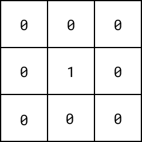
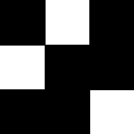

# Les images

## Introduction

Ces travaux pratiques ont pour objectif de vous faire manipuler des tableaux à deux dimensions,
notamment dans le cadre de la génération d'images.

## Préparation

### Espace de travail

Vous allez créer des dossiers afin de ne pas mélanger vos productions numériques entre vos différentes matières et
travaux pratiques.

!!! note "Organisation de l'espace travail"

    === ":material-laptop: Ordinateur portable"

        1. Lancez l'application <i class="icon file-explorer"></i> **Explorateur de fichiers** 
           <span class="keys shortcut"><kbd>:fontawesome-brands-windows:</kbd><span>+</span><kbd>E</kbd></span>
        2. Dans le dossier `Document`, s'il n'y a pas de dossier nommé `NSI`, créez-le
        4. Dans le dossier `NSI`, s'il n'y a pas de dossier `chapitre_06`, créez-le
        5. Dans le dossier `chapitre_06` créez le dossier `tp2`

    === ":material-desktop-tower: Ordinateur fixe"

        1. Depuis le bureau, double-cliquez sur l'icône intitulée **Zone personnelle**
        2. Dans la **zone personnelle**, s'il n'y a pas de dossier `NSI`, créez-le
        3. Dans le dossier `NSI`, s'il n'y a pas de dossier `chapitre_06`, créez-le
        4. Dans le dossier `chapitre_06` créez le dossier `tp2`

### Téléchargement

Pour réaliser ces travaux pratiques, il est nécessaire de disposer de certains fichiers.

!!! note "Récupération des fichiers"

    1. Téléchargez le fichier ZIP contenant les fichiers nécessaires : [:material-download: télécharger](assets/NSI1RE06_TP2.zip){:download="NSI1RE06_TP2.zip"}
    2. Ouvrez le fichier ZIP<br>*(si le navigateur ne l'ouvre automatiquement, cliquez sur le fichier téléchargé)*
    3. Sélectionnez tous les fichiers et dossiers  <span class="shortcut">++ctrl+a++</span>
    4. Copiez tous les fichiers et dossiers <span class="shortcut">++ctrl+c++</span>
    5. Collez les fichiers dans le dossier `NSI\chapitre_06\tp2` <span class="shortcut">++ctrl+v++</span>

## Pixel Art

### 1.1. Le module `images`

Afin de faciliter la création d'images, votre enseignant a créé le module Python `images` dont le code source se trouve
dans le fichier `images.py`.
Ce module a pour dépendance la bibliothèque
[:material-link: Pillow](https://pillow.readthedocs.io/en/stable/){:target="_blank"}
permettant de manipuler des images depuis Python.

!!! target "Objectif de l'exercice"

    - Installer la dépendance **Pillow**
    - Vérifier le bon fonctionnement du module `images`

!!! note "Installation des dépendances"

    1. Lancez l'application Thonny
    2. Choisissez **Outils > Gérer les paquets...** depuis la barre de menus
    3. Saisissez `pillow` dans le champs de recherche puis cliquez sur **Rechercher sur PyPI**
    4. Cliquez sur **Pillow** dans la liste de résultats
    4. Cliquez sur **Installer**

!!! note "Vérification du module `images`"

    1. Retournez dans l'application Thonny
    2. Créez un nouveau fichier
    3. Enregistrez-le immédiatement dans le dossier des travaux pratiques en le nommant `ex11_test.py`
    4. Ajoutez l'instruction Python d'import du module `images`
    5. Ajoutez un appel à la fonction `#!python afficher_test()` du module `images`
    6. Lancez le programme

??? success "Résultat attendu"

    Si votre programme fonctionne correctement, vous devez obtenir l'affichage suivant :

    <figure markdown>
        {:style="border:1px solid black;"}
    </figure>

    ??? info "Solution"

        ```python
        import images
        images.afficher_test()
        ```

### 1.2. Première image

Nous souhaitons afficher une image à partir des valeurs d'un tableau à deux dimensions.
Un pixel noir ne sera affiché que si l'élément correspondant du tableau contient la valeur `#!python 1`.

!!! target "Objectifs de l'exercice"

    - Savoir construire un tableau à deux dimensions en Python
    - Comprendre la structure et savoir affecter des valeurs aux bons éléments d'un tableau

!!! note "Création de l'image"

    1. Retournez dans l'application Thonny
    2. Créez un nouveau fichier
    3. Enregistrez-le immédiatement dans le dossier des travaux pratiques en le nommant `ex12_pixels.py`
    4. Ajoutez l'instruction Python d'import du module `images`
    5. Créez un tableau à deux dimensions nommé `pixels` correspondant à la représentation suivante :
    <figure markdown>
        {:style="max-width:152px;"}
    </figure>
    6. Ajoutez un appel à la fonction `afficher_image` du module `images` en lui passant la variable `pixels` en argument
    7. Lancez le programme

??? success "Résultat attendu"

    Si votre programme fonctionne correctement, vous devez obtenir l'affichage suivant :

    <figure markdown>
        {:style="border:1px solid black;max-width:200px;"}
    </figure>

    ??? info "Solution"

        ```python
        import images
        
        pixels = [
            [0, 0, 0],
            [0, 1, 0],
            [0, 0, 0],
        ]
        
        images.afficher_image(pixels)
        ```

!!! note "Modification de l'image"

    Modifiez les valeurs du tableau à deux dimensions `pixels` de façon à obtenir l'affichage suivant :

    <figure markdown>
        {:style="border:1px solid black;max-width:200px;"}
    </figure>

### 1.3. Image générée

Les pixels de l'image de l'exercice précédent ont été disposés un par un manuellement.
Nous souhaitons maintenant définir les pixels d'une image de **taille quelconque** selon des **règles**.
Pour cela, il sera nécessaire d'automatiser le placement des pixels.

<h4>Dimensions d'un tableau 2D</h4>

!!! target "Objectifs de l'exercice"

    - Savoir obtenir la taille d'un tableau
    - Savoir distinguer les lignes et les colonnes d'un tableau à deux dimensions

!!! note "Mise en pratique"

    1. Retournez dans l'application Thonny
    2. Ouvrez le fichier `ex13_bordure.py`
    3. Complétez la fonction `afficher_dimensions` qui prend en paramètre un tableau 2D et affiche ses dimensions comme suit :

    !!! console "Console Python"
    
        ```
        >>> pixels = [[0, 0, 0], [0, 0, 0]]
        >>> afficher_dimensions(pixels)
        3 x 2
        ```

<h4>Ajout d'une bordure à une image</h4>

Soit une image représentée par un tableau 2D dont chaque valeur correspond à l'état d'un pixel.
Nous souhaitons disposer de la fonction `#!python dessiner_bordure()` permettant d'ajouter une bordure à une image.

<figure markdown>
{:style="max-width:200px;"}
</figure>

!!! target "Objectifs de l'exercice"

    - Savoir parcourir un tableau à deux dimensions
    - Savoir affecter des valeurs à un tableau à deux dimensions
    - Savoir déduire un algorithme à partir d'une consigne

!!! note "Mise en pratique"

    1. Retournez dans l'application Thonny
    2. Revenez au fichier `ex13_bordure.py`
    3. Implémenter la fonction `dessiner_bordure` prenant en paramètre un tableau 2D et affectant 1 aux éléments de façon à ajouter une bordure à l'image

    !!! console "Console Python"

        ```
        >>> pixels = [[0, 0, 0], [0, 0, 0], [0, 0, 0]]
        >>> dessiner_bordure(pixels)
        >>> pixels
        [[1, 1, 1], [1, 0, 1], [1, 1, 1]]
        >>> images.afficher_image(pixels)
        ```

??? help "Aide"
    
    ```python
    for ligne in range(len(image)):
        # Cas de la première ligne. Affecter 1 partout.
        if ligne == 0:
            ...

        # Cas de la dernière ligne. Affecter 1 partout.
        elif ligne == len(image) - 1:
            ...

        # Sinon, affecter 1 au premier et dernier élément.
        else:
            ...
    ```


## Génération d'un tableau 2D

### 2.1. Conversion d'un tableau

Nous souhaitons disposer d'une fonction `tableau_vers_chaine` ayant pour seul paramètre un tableau d'entiers `tableau`.
Celle-ci renvoie le contenu de `tableau` sous forme d'une chaîne de caractères comme suit :

!!! console "Console Python"

    ```
    >>> tableau_vers_chaine([2, 4, 6, 8])
    '2 4 6 8'
    ```

!!! note "Mise en pratique"

    1. Retournez dans l'application Thonny
    1. Ouvrez le fichier `tableau.py`
    2. Implémentez la fonction `tableau_vers_chaine`
    3. Lancez le programme et assurez-vous que les tests automatisés ne signalent aucune erreur pour la fonction `tableau_vers_chaine`

??? help "Aide"

    ```python
    contenu = ""

    for i in range(len(tableau))
        ...

    return contenu
    ```

### 2.2. Affichage d'un tableau 2D

Nous souhaitons disposer d'une procédure `afficher_tableau_2d` ayant pour seul paramètre un tableau d'entiers à deux
dimensions
d'entiers `tableau`.
Cette fonction affiche le contenu de `tableau` de façon comparable à l'exemple suivant :

!!! console "Console Python"

    ```
    >>> afficher_tableau_2d([[1, 2], [3, 4], [5, 6]])
    1 2
    3 4
    5 6
    ```

!!! note "Mise en pratique"

    1. Retournez dans l'application Thonny
    2. Revenez au fichier `tableau.py`
    3. Implémentez la fonction `afficher_tableau_2d`<br>*(pensez à utiliser la fonction `tableau_vers_chaine`)*
    4. Lancez le programme et assurez-vous que les tests automatisés ne signalent aucune erreur pour la fonction `afficher_tableau_2d`

### 2.3. Génération d'un tableau 2D

Nous souhaitons disposer d'une fonction `generer_tableau_2d` renvoyant un tableau à deux dimensions.
Elle dispose des paramètres suivants :

- `largeur` - Entier correspondant à la largeur du tableau (nombre de colonnes)
- `hauteur` - Entier correspondant à la hauteur du tableau (nombre de lignes)
- `valeur` - Valeur initiale des éléments du tableau

!!! console "Console Python"

    ```
    >>> test = generer_tableau_2d(5, 5, 0)
    >>> test[2][2] = 1
    >>> afficher_tableau_2d(test)
    0 0 0 0 0
    0 0 0 0 0
    0 0 1 0 0
    0 0 0 0 0
    0 0 0 0 0
    ```

!!! note "Mise en pratique"

    1. Retournez dans l'application Thonny
    2. Revenez au fichier `tableau.py`
    3. Implémentez la fonction `generer_tableau_2D`<br>*(pensez à utiliser les tableaux en compréhension ou l'opérateur `*`)*
    4. Lancez le programme et assurez-vous que les tests automatisés ne signalent aucune erreur pour la fonction `generer_tableau_2d`

??? help "Aide"

    ```python
    return [[...] * ... for _ in range(...)]
    ```

## Image colorée

### Introduction

#### Les tuples

Un objet de type **tuple** (aussi appelé *p-uplet*), est une suite ordonnée d'éléments pouvant être chacun de **n'importe quel
type** (contrairement aux tableaux ont les éléments sont tous de même type). 
Un *p-uplet* s'utilise comme enregistrement de données hétérogènes liées entre elles.

!!! example "Exemple"

    ```python
    # Syntaxe
    p_uplet = (valeur_1, ..., valeur_p)
    
    # Utilisation d'un p-uplet pour stocker les informations d'un pixel
    pixel = (255, 0, 0, 1.0)
    ```
    
    Dans l'exemple ci-dessus, on utilise un *p-uplet* pour stocker les composantes rouge, vert et bleu d'un pixel sous
    forme d'entiers. Le degré de transparence du pixel stocké sous forme d'un flottant.

#### La couleur

Une couleur est définie par 3 entiers compris entre 0 et 255 correspondant respectivement aux composantes rouge, vert et
bleue.
En Python, nous pouvons représenter une couleur sous forme d'un tuple de 3 éléments : `(rouge, vert, bleu)`

!!! question "Identifiez les couleurs"

    1. Quelle couleur représente le tuple `#!python (255, 0, 0)` ?
    2. Quelle couleur représente le tuple `#!python (255, 255, 0)` ?
    3. Quelle couleur représente le tuple `#!python  (150, 150, 150)` ?

??? success "Réponses"

    1. La couleur représentée par le tuple `#!python (255, 0, 0)` est le **rouge**
    2. La couleur représentée par le tuple `#!python (255, 255, 0)` est le **jaune**
    3. La couleur représentée par le tuple `#!python  (150, 150, 150)` est le **gris**

### 3.1. Génération d'une couleur

Nous souhaitons disposer de la fonction `generer_couleur` renvoyant une couleur sous forme d'un tuple de 3 valeurs.
Celle-ci prend un unique paramètre nommé `intensite`, un entier compris entre 0 et 255 définissant l'intensité de la
couleur générée.
Le choix de la couleur générée est libre.

!!! example "Exemples"

    === "Nuances de rouge"
        Si vous choisissez le rouge, votre fonction permettra de générer 256 nuances de rouge : du noir au rouge vif

        ```
        >>> generer_couleur(0)
        (0, 0, 0)
        >>> generer_couleur(125)
        (125, 0, 0)
        >>> generer_couleur(255)
        (255, 0, 0)
        ```

    === "Nuances de magenta" 
        Si vous choisissez le magenta, votre fonction permettra de générer 256 nuances de magenta : du noir au magenta vif

        ```
        >>> generer_couleur(0)
        (0, 0, 0)
        >>> generer_couleur(125)
        (125, 0, 125)
        >>> generer_couleur(255)
        (255, 0, 255)
        ```

!!! note "Mise en pratique"

    1. Retournez dans l'application Thonny
    2. Créer un nouveau fichier
    3. Enregistrez-le immédiatement dans le dossier des travaux pratiques en le nommant `main.py`
    4. Implémentez la fonction `generer_couleur`

### 3.2. Génération d'un fond uni

On définit une image par un tableau à deux dimensions dont chaque élément correspond à une couleur.
Nous souhaitons disposer de la fonction `generer_fond_uni` qui renvoie un tableau de couleurs de taille est 256x256.

!!! tip "Conseils"

    - Récupérez la fonction `generer_tableau` crée précédemment pour générer le tableau à deux dimensions de l'image
    - Utilisez la fonction `generer_couleur` pour obtenir la couleur qui sera utilisée comme valeur d'initialisation des éléments du tableau à deux dimensions
    - Utilisez la fonction `afficher_image_couleur` du module `images` pour visualiser l'image générée

### 3.3. Génération d'un dégradé

Nous souhaitons disposer de la fonction `generer_degrade` qui renvoie un tableau de couleurs de taille est 256x256 dont
l'image correspond cette fois à un dégradé.

!!! example "Exemple"

    <figure markdown>
    
    </figure>

!!! tip "Conseils"

    - Commencez par générer un tableau de taille 256x256 
    - Parcourir ensuite chaque ligne du tableau en affectant la valeur renvoyée par `generer_couleur` tout en faisant varier l'intensité de la couleur

!!! success "Version évoluée"

    Créer une fonction renvoyant un tableau de couleurs de taille est 256x256 dont l'image correspond à des dégradés
    superposés.
    Pour cela, faire varier horizontalement et verticalement les composantes des couleurs.
    L'utilisation de la fonction `generer_couleur` n'est plus nécessaire.

    <figure markdown>
        
    </figure>
