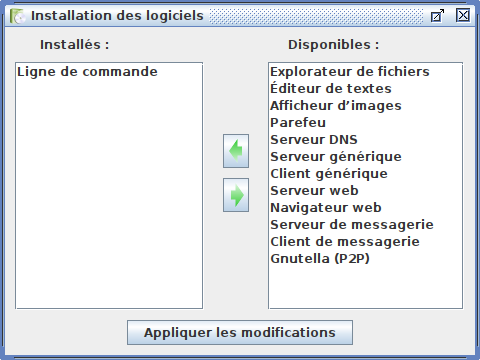
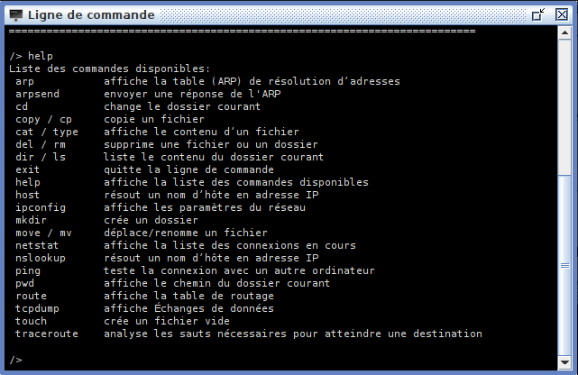
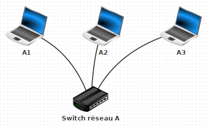
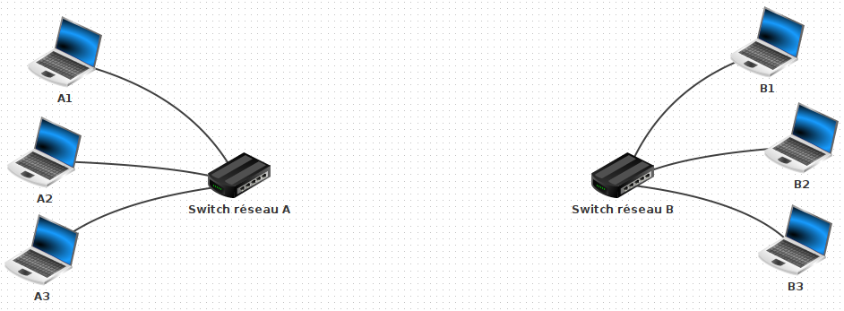

# Simulation d'un réseau

## Introduction

Ces travaux pratiques ont pour objectif de vous familiariser avec les différents dispositifs constitutifs d'un réseau
informatique et de comprendre le rôle d'un routeur.

!!! success "Objectifs"

    - comprendre ce qu'est une adresse IP
    - comprendre le rôle d'un commutateur ethernet
    - comprendre le rôle d'un routeur

## Préparation

### Espace de travail

Afin vos productions numériques ne soient pas mélangées entre les différentes matières et travaux pratiques,
vous allez créer des dossiers afin de les organiser.

!!! note "Organisation de l'espace travail"

    1. Depuis le bureau, double-cliquez sur l'icône intitulée **Zone personnelle**
    2. Une fois dans votre zone personnelle, créez un nouveau dossier nommé **SNT** s'il n'existe pas déjà
    3. Entrez dans le dossier **SNT** et créez-y un nouveau dossier nommé **Réseau**

!!! warning "Attention au risque de perte de fichiers"

    Veillez à **toujours** enregistrer vos fichiers dans le dossier **Zone personnelle** (ou un de ses sous-dossiers).
    Ceux-ci seront alors accessibles depuis n'importe quel ordinateur du lycée.
    Tout fichier enregistré ailleurs que ce dossier sera irrémédiablement perdu.

### Logiciel Filius

Les réseaux virtuels seront construits grâce au logiciel Filius. Celui-ci est installé sur les ordinateurs du lycée.

!!! note "Lancement de Filius"

    1. Localisez le logiciel Filius sur l'ordinateur
    2. Lancez le logiciel
    3. **Attention** ! Si un choix de langue vous est proposé, choisissez le Français

## Deux machines en réseau

### Construction

Dans ce premier exercice, vous allez créer un réseau simplement constitué de deux machines interconnectées.

!!! note "Construction du réseau"

    <h5>Ajout d'un premier ordinateur</h5>

    1. Créez un premier ordinateur portable
    2. Nommez-le **A1**
    3. Attribuez-lui l'adresse IP `192.168.1.10`

    <h5>Ajout d'un second ordinateur</h5>

    1. Créez un second portable au réseau
    2. Nommez-le **A2**
    3. Attribuez-lui l'adresse IP `192.168.1.20`

    <h5>Connection des ordinateurs</h5>
    
    1. Pour terminer la construction, connectez les ordinateurs à l'aide d'un **câble ethernet**

!!! warning "Attention la saisie des adresses IP"

    Vérifiez bien les adresses IP saisies. Une erreur fréquente est de saisir `192.168.0.10` au lieu de `192.168.1.10`.

### Simulation

Maintenant que notre réseau est construit, nous allons en simuler le fonctionnent.
Les ordinateurs vont donc s'allumer virtuellement et être en mesure de communiquer l'un avec l'autre.
Pour tester cette communication, il est nécessaire d'installer virtuellement quelques logiciels.

!!! note "Configuration de l'ordinateur"

    1. Lancez la simulation en cliquant le bouton *lecture* (le triangle vert)
    2. Cliquez sur l'ordinateur **A1**. Un nouvel écran doit s'ouvrir
    3. Cliquez sur *Installation des logiciels*
    4. Installez le logiciel *Ligne de commande* en le sélectionnant puis en cliquant sur la flèche pour le déplacer de la liste *Disponibles* vers la liste *Installés* 
    5. Cliquer sur le bouton *Appliquer les modifications*
    6. Le logiciel *Ligne de commande* doit être **uniquement** installé sur l'ordinateur *A1*

    <figure markdown>
      
    </figure>

### Paramètres réseau

Vous allez maintenant utiliser l'application **ligne de commande** installée précédemment.
Celle-ci consiste en une fenêtre dans laquelle vous pouvez saisir des commandes au clavier.
Il existe des commandes axées sur la manipulation des fichiers et des dossiers et d'autres, axées sur la gestion du
réseau.

!!! note "Découverte de la commande `ipconfig`"

    1. Lancez l'application **ligne de commande** installée sur la machine **A1**<br>
       *(toutes les commandes de ces travaux pratiques devront être lancées uniquement depuis la machine A1)*
    2. Exécutez la commande **help** en l'écrivant au clavier et en appuyant sur la touche *entrée*<br>
       *(les mêmes informations affichées lors du lancement de l'application ligne de commande doivent se réafficher.)*
    3. Dans la liste des commandes, retrouvez celle nommée `ipconfig` et lisez sa description

    <figure markdown>
      
    </figure>

??? info "Culture informatique"

    Les commandes disponibles existent réellement. Elles peuvent être exécutées, pour la plupart, depuis tout ordinateur Windows via l'application *Commandes Windows*.

La commande `ipconfig` permet d'obtenir la configuration réseau de l'ordinateur depuis lequel vous appelez cette
commande. Vous allez lancer la commande *ipconfig* afin de vérifier la configuration réseau de l'ordinateur **A1**.

!!! note "Lancement de la commande `ipconfig`"

    1. Retournez dans l'application *ligne de commande*
    2. Lancez la commande `ipconfig` de la même façon que pour `help`
    3. Lisez le résultat. Vous devriez reconnaître l'une des informations. Sa valeur est-elle cohérente ?

??? success "Résultat attendu"

    En lançant la commade **ipconfig**, vous devriez obtenir un affichage proche de celui ci-dessous :

    ``` hl_lines="2 2"
    /> ipconfig
    Adresse IP . . .: 192.168.1.10
    Masque . . . . .: 255.255.255.0
    Adresse MAC. . .: 12:20:1A:16:F3:ED
    Passerelle . . .:
    Serveur DNS. . .:
    ```

    Si vous observez la ligne surlignée, vous devez retrouver l'adresse IP `192.168.1.10` correspondant à celle attribuée à la machine **A1** lors de la construction du réseau

### Connectivité

!!! note "Découverte de la commande `ping`"

    1. Lancez à nouveau la commande `help`
    2. Retrouvez la commande `ping` dans la liste des commandes affichées et lisez sa descriptiom

Pour la commande **ping**, il est nécessaire d'indiquer l'adresse IP de la machine dont on souhaite vérifier la
connectivité sur le réseau.
On dit que la commande **ping** prend un argument, c'est-à-dire qu'il est nécessaire de lui fournir une information
supplémentaire afin qu'elle puisse fonctionner.

??? example "Exemple d'utilisation de la commande `ping`"

    Depuis une machine **X**, nous souhaiterions tester la connectivité avec une machine **Y** du réseau d'adresse IP `10.0.0.99`.
    Pour celà, nous écririons l'appel de la commande `ping` ainsi : 

    ```
    ping 10.0.0.99
    ```

!!! note "Test de connectivité entre la machine A1 et A2"

    On rappelle que l'adresse IP de la machine **A2** est `192.168.1.20` :
    
    1. Retournez dans l'application **ligne de commande**
    2. Lancez la commande `ping` avec comme argument l'adresse IP de la machine **A2**
    3. Observez et essayez de comprendre l'affichage obtenu

??? success "Résultat attendu"

    En lançant la commande `ping` avec comme argument `192.168.1.20`, vous devriez obtenir un affichage proche de celui-ci :

    ``` hl_lines="8 8"
    /> ping 192.168.1.20
    PING 192.168.1.20 (192.168.1.20)
    From 192.168.1.20 (192.168.1.20): icmp_seq=1 ttl=64 time=115ms
    From 192.168.1.20 (192.168.1.20): icmp_seq=2 ttl=64 time=19ms
    From 192.168.1.20 (192.168.1.20): icmp_seq=3 ttl=64 time=19ms
    From 192.168.1.20 (192.168.1.20): icmp_seq=4 ttl=64 time=20ms
    --- 192.168.1.20 Statistiques des paquets ---
    4 paquets transmis, 4 paqauets reçus, 0% paquets perdus
    ```

    Si vous observez la ligne surlignée, vous constatez la machine **A1** d'où vous utilisez la ligne de commande, a envoyé 4 paquets de données à la machine **A2** et que ceux-ci ont bien été reçu.

## Réseau de plusieurs machines

### Construction

Nous souhaitons agrandir le réseau en y ajouter un troisième ordinateur portable.
Les ordinateurs ne disposent que d'une seule connexion ethernet.
Ils ne peuvent donc être connectés qu'à un seul équipement du réseau à la fois.

!!! note "Modification du réseau"

    1. Retournez au mode construction en cliquant sur le **marteau**
    2. Coupez le fil entre **A1** et **A2** (*clic droit* puis *Supprimer le cable*)
    3. Ajoutez un commutateur réseau (*switch* en anglais) et nommer le **Switch réseau A**
    4. Ajoutez un ordinateur portable nommé **A3** avec comme adresse IP `192.168.1.30`
    5. Connectez tous les ordinateurs au switch

    <figure markdown>
      
    </figure>

### Simulation

!!! note "Test de connectivité"

    1. Lancez la simulation
    2. Testez la connectivité effectuant un ping de la machine **A1** vers le **A2**
    3. Testez la connectivité effectuant un ping de la machine **A1** vers le **A3**

!!! info "Adresse d'un réseau"

    Les adresses IP n'ont pas été choisies au hasard. Qu'observez-vous celles des machines **A1**, **A2** et **A3** ? Qu'ont-elles en commun ?

## Réseau de réseaux

### Construction du réseau

Nous souhaitons maintenant agrandir notre réseau en le connectant à un nouveau réseau bien distinct.

!!! note "Modification du réseau"

    1. Retournez au mode construction en cliquant sur le **marteau**
    2. Créez un nouveau réseau en complément du premier dont les caractéristiques sont détaillées dans le tableau ci-dessous :

    <div style="text-align:center">

    | Équipement | Nom             | Adresse IP     |
    |:-----------|:----------------|:---------------|
    | Portable   | B1              | `192.168.2.10` |
    | Portable   | B2              | `192.168.2.20` |
    | Portable   | B3              | `192.168.2.30` |
    | Switch     | Switch réseau B | -              |

    </div>

    <figure markdown>
      
    </figure>


### Simulation

!!! note "Connexion des deux réseaux"

    1. À l'aide d'un câble, connectez directement les switchs entre eux
    2. Lancez la simulation
    3. Testez un ping du portable **A1** vers le portable **B3**

??? failure "Résultat attendu"
    
    Le portable **A1** arrive-t-il à communiquer avec le portable **B3** ? Non car malgré une connexion directe,
    c'est machine n'appartiennent pas au meme résau. 
    En effet, les machines du réseau A ont toutes une adresse IP commençant par `192.168.1` alors que celle du réseau B voient leur adresse IP commencer par `192.1683.2` 
    L'équipelent qui permettrait de connecter correctement les deux réseaux s'appelle un **routeur** ? 


### Ajout du routeur

Les machines du réseau A ne peuvent pas communiquer avec le réseau B malgré une connection direct entre les switchs.
En effet, des machines sont considérées du même réseau, et peuvent alors communiquer entre elles, que si leur adresse IP
partagent le même préfixe :
`192.168.1` pour le réseau A et `192.168.2` pour le réseau B. Pour lier deux réseaux, il est nécessaire d'utiliser un
**routeur**.

!!! note "Modification du réseau"

    1. Retourner au mode construction en cliquant sur le **marteau**
    2. Supprimer le câble entre les deux switchs 
    3. Ajouter un routeur et indiquer qu'il possède 2 interfaces 
    4. Donner l'adresse IP `192.168.1.1` à la première interface 
    5. Donner l'adresse IP `192.168.2.1` à la seconde interface 
    6. Connecter **en premier** le switch du réseau **A** au routeur 
    7. Connecter ensuite le witch du réseau **B** au routeur

    <figure markdown>
      
    </figure>

Il reste maintenant à ajuster un dernier point de configuration. La valeur de la passerelle doit être renseignée pour
chaque ordinateur des réseaux.

!!! note "Configuration de la passerelle"

    - Renseigner l'adresse IP `192.168.1.1` pour la passerelle des réseaux **A1**, **A2** et **A3**
    - Renseigner l'adresse IP `192.168.2.1` pour la passerelle des réseaux **B1**, **B2** et **B3**

!!! info "Qu'est-ce la passerelle ?"
  
    La **passerelle** permet d'indiquer à aux machines où transmettre les paquets si l'adresse IP du destinataire ne fait
    pas partie de leur réseau.
    Nous avons renseigné ici pour chacune des machines l'adresse IP du routeur. Mais pourquoi deux adresses IP distinctes ?
    C'est parce que le routeur dispose de deux interfaces, une pour se connecter au réseau A
    et se connecter au réseau B. Son rôle est alors de faire le pont entre les deux réseaux.

### Connectivité

!!! note "Test de connectivité entre les deux réseaux"

    1. Lancer la simulation
    2. Tester un ping du portable **A1** vers le portable **B3**
    3. Au lieu de ping, utiliser cette fois la commande `traceroute` vers le portable **B3**
    4. Essayez de comprendre l'utilité de cette commande