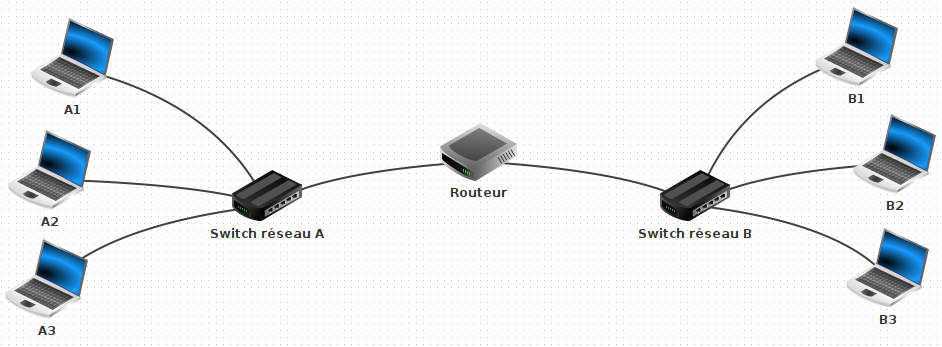

# Simulation d'un réseau

## Introduction

Ces travaux pratiques sont une introduction aux réseaux informatiques.
Vous découvrirez comment mettre en réseau des ordinateurs ainsi que le rôle de certains équipements.

!!! success "Objectifs"

    - comprendre ce qu'est une adresse IP
    - comprendre le rôle d'un commutateur ethernet (ou *switch* en anglais)
    - comprendre le rôle d'un routeur

## Préparation

### Espace de travail

Vous allez créer quelques dossiers afin de ne pas mélanger vos productions numériques entre vos différentes matières et
travaux pratiques.

!!! note "Organisation de l'espace travail"

    1. Depuis le bureau, double-cliquez sur l'icône intitulée **Zone personnelle**
    2. Une fois dans votre zone personnelle, créez un nouveau dossier nommé **SNT** s'il n'existe pas déjà
    3. Entrez dans le dossier **SNT** et créez-y un nouveau dossier nommé **Internet** s'il n'existe pas déjà

??? warning "Attention au risque de perte de fichiers"

    Pensez à **toujours** enregistrer vos fichiers dans le dossier **Zone personnelle** (ou un de ses sous-dossiers).
    Ceux-ci seront alors accessibles depuis n'importe quel ordinateur du lycée.
    Tout fichier enregistré ailleurs que ce dossier sera irrémédiablement perdu.

### Logiciel de simulation de réseau

Vous allez construire un réseau virtuel, c'est-à-dire simulé par un logiciel.
Le logiciel à utiliser se nomme **Filius** et est disponible sur les ordinateurs du lycée.

!!! note "Lancement de Filius"

    1. Localisez et lancez le logiciel **Filius**
    2. **Attention, n'allez pas trop vite** ! Si un choix de langue vous est proposé, choisissez le Français

## Deux machines en réseau

### Construction

Dans ce premier exercice, vous allez créer un réseau très simple constitué de deux ordinateurs interconnectés.
Tout ordinateur relié à un réseau informatique est appelé **hôte**.

!!! note "Construction du réseau"

    <h5>Ajout d'un premier ordinateur</h5>

    1. Créez un ordinateur portable
    2. Nommez-le **A1**
    3. Attribuez-lui l'adresse IP `192.168.1.10`

    <h5>Ajout d'un second ordinateur</h5>

    1. Créez un second ordinateur portable
    2. Nommez-le **A2**
    3. Attribuez-lui l'adresse IP `192.168.1.20`

    <h5>Mise en réseau des ordinateurs</h5>
    
    1. Pour terminer la construction, connectez les ordinateurs à l'aide d'un **câble ethernet**

??? warning "Attention la saisie des adresses IP"

    Vérifiez bien les adresses IP saisies. Une erreur fréquente est de saisir `192.168.0.10` au lieu de `192.168.1.10`.

!!! info "L'adresse IP"

    Une adresse IP est un numéro d'identification unique attribué à une machine faisant partie d'un réseau informatique.
    Elle est généralement représentée en notation décimale avec quatre nombres compris entre 0 et 255, séparés par des points.
    Exemple : `216.58.214.67`

### Simulation

Maintenant que le réseau est construit, vous allez en simuler le fonctionnent.
Les ordinateurs vont donc s'allumer virtuellement et être en mesure de communiquer l'un avec l'autre.
Pour tester cette communication, il est nécessaire d'installer virtuellement quelques logiciels.

!!! note "Configuration de l'ordinateur"

    1. Lancez la simulation en cliquant le bouton **lecture** (le triangle vert)
    2. Cliquez sur l'ordinateur **A1**. Un nouvel écran doit s'ouvrir
    3. Cliquez sur **Installation des logiciels**
    4. Installez le logiciel **Ligne de commande** en le sélectionnant puis en cliquant sur la flèche pour le déplacer de la liste *« Disponibles »* vers la liste *« Installés »* 
    5. Cliquer sur le bouton *« Appliquer les modifications »*

    <figure markdown>
      
    </figure>

!!! warning "Attention"

    Le logiciel **Ligne de commande** n'est à installer que sur un seul ordinateur : l'ordinateur **A1**.

### Paramètres réseau

Vous allez maintenant utiliser l'application **ligne de commande** installée précédemment.
Celle-ci consiste en une fenêtre dans laquelle vous pouvez saisir des commandes au clavier.

Il existe des commandes dédiées à la manipulation des fichiers et des dossiers et d'autres, dédiées à la gestion du
réseau informatique.

!!! note "Découverte de la commande `ipconfig`"

    1. Lancez l'application **ligne de commande** installée sur la machine **A1**<br>
       *(toutes les commandes de ces travaux pratiques devront être lancées uniquement depuis la machine A1)*
    2. Exécutez la commande **help** en l'écrivant au clavier et en appuyant sur la touche *entrée*<br>
       *(les mêmes informations affichées lors du lancement de l'application ligne de commande doivent se réafficher.)*
    3. Dans la liste des commandes, retrouvez celle nommée `ipconfig`. Lisez sa courte description

    <figure markdown>
      
    </figure>

!!! info "Les commandes"

    L'ensemble des commandes listées existent réellement. Elles peuvent être exécutées, pour la plupart, depuis tout ordinateur Windows via l'application **Commandes Windows**.

La commande `ipconfig` permet d'obtenir la configuration réseau de l'hôte sur lequel vous êtes connecté.
Vous allez lancer la commande `ipconfig` afin de vérifier la configuration réseau de l'ordinateur **A1**.

!!! note "Lancement de la commande `ipconfig`"

    1. Retournez dans l'application **ligne de commande** lancée depuis l'hôte **A1**
    2. Lancez la commande `ipconfig` de la même façon que pour `help`
    3. Lisez le résultat. Vous devriez reconnaître l'une des informations. Sa valeur est-elle cohérente ?

??? success "Résultat attendu"

    En lançant la commande **ipconfig**, vous devriez obtenir un affichage proche de celui ci-dessous :

    ``` hl_lines="2 2"
    /> ipconfig
    Adresse IP . . .: 192.168.1.10
    Masque . . . . .: 255.255.255.0
    Adresse MAC. . .: 12:20:1A:16:F3:ED
    Passerelle . . .:
    Serveur DNS. . .:
    ```

    Si vous observez la ligne surlignée, vous devez retrouver l'adresse IP `192.168.1.10` correspondant à celle attribuée à la machine **A1** lors de la construction du réseau

### Connectivité

Nous aimerions maintenant vérifier que les hôtes **A1** et **A2** puissent bien communiquer l'un avec l'autre.
Il existe une commande pour celà, la commande `ping`.

!!! note "Découverte de la commande `ping`"

    1. Retournez dans l'application **ligne de commande** lancée depuis l'hôte **A1**
    2. Lancez à nouveau la commande `help`
    3. Retrouvez la commande `ping` dans la liste des commandes et lisez sa descriptiom

Pour fonctionner, la commande `ping` nécessite qu'on lui indique l'adresse IP de l'hôte pour lequel on souhaite vérifier
la connectivité sur le réseau.
On dit que la commande **ping** prend un **argument**, c'est-à-dire qu'il est nécessaire de lui fournir une information
supplémentaire.

??? example "Exemple d'utilisation de la commande `ping`"

    Depuis un hôte **X**, nous souhaitons tester la connectivité avec un hôte **Y** d'adresse IP `10.0.0.99`.
    Pour celà, nous écririons l'appel de la commande `ping` ainsi : 

    ```
    ping 10.0.0.99
    ```

!!! note "Test de connectivité entre la machine A1 et A2"

    On rappelle que l'adresse IP de la machine **A2** est `192.168.1.20` :
    
    1. Retournez dans l'application **ligne de commande** lancée depuis l'hôte **A1**
    2. Lancez la commande `ping` avec comme argument l'adresse IP de la machine **A2**
    3. Observez et essayez de comprendre l'affichage obtenu

??? success "Résultat attendu"

    En lançant la commande `ping` avec comme argument `192.168.1.20`, vous devriez obtenir un affichage proche de celui-ci :

    ``` hl_lines="8 8"
    /> ping 192.168.1.20
    PING 192.168.1.20 (192.168.1.20)
    From 192.168.1.20 (192.168.1.20): icmp_seq=1 ttl=64 time=115ms
    From 192.168.1.20 (192.168.1.20): icmp_seq=2 ttl=64 time=19ms
    From 192.168.1.20 (192.168.1.20): icmp_seq=3 ttl=64 time=19ms
    From 192.168.1.20 (192.168.1.20): icmp_seq=4 ttl=64 time=20ms
    --- 192.168.1.20 Statistiques des paquets ---
    4 paquets transmis, 4 paquets reçus, 0% paquets perdus
    ```

    Si vous observez la ligne surlignée, vous constatez l'hôte **A1**, d'où vous utilisez la ligne de commande, a transmis 4 paquets de données à l'hôte **A2**.
    Ceux-ci ayant bien été reçus, il y a connectivité réseau entre **A1** et **A2**.

## Réseau de plusieurs machines

### Construction

Nous souhaitons agrandir le réseau en y ajouter un troisième hôte.
Les ordinateurs ne disposent que d'une seule connexion ethernet.
Ils ne peuvent donc être connectés qu'à un seul équipement du réseau à la fois.
Un nouvel équipement est donc nécessaire pour pouvoir les relier tous les trois : le **commutateur ethernet**

!!! note "Modification du réseau"

    1. Retournez au mode construction en cliquant sur le **marteau**
    2. Coupez le fil entre **A1** et **A2** (*clic droit* puis *Supprimer le cable*)
    3. Ajoutez un commutateur réseau (*switch* en anglais) et nommer le **Switch réseau A**
    4. Ajoutez un ordinateur portable nommé **A3** avec comme adresse IP `192.168.1.30`
    5. Connectez tous les ordinateurs au switch

    <figure markdown>
      
    </figure>

### Simulation

!!! note "Test de connectivité"

    1. Lancez la simulation
    2. Testez la connectivité effectuant un ping de la machine **A1** vers le **A2**
    3. Testez la connectivité effectuant un ping de la machine **A1** vers le **A3**

!!! question "Choix des adresses IP"

    Les adresses IP n'ont pas été choisies au hasard. Qu'observez-vous celles des machines **A1**, **A2** et **A3** ? Qu'ont-elles en commun ?
    Gardez la réponse pour vous, des explications vous seront données dans l'exercice suivant.

## Réseau de réseaux

### Construction du réseau

Nous souhaitons maintenant agrandir notre réseau en le connectant à un nouveau réseau bien distinct.

!!! note "Modification du réseau"

    1. Retournez au mode construction en cliquant sur le **marteau**
    2. Créez un nouveau réseau en complément du premier dont les caractéristiques sont détaillées dans le tableau ci-dessous :

    <div style="text-align:center">

    | Équipement | Nom             | Adresse IP     |
    |:-----------|:----------------|:---------------|
    | Portable   | B1              | `192.168.2.10` |
    | Portable   | B2              | `192.168.2.20` |
    | Portable   | B3              | `192.168.2.30` |
    | Switch     | Switch réseau B | -              |

    </div>

    <figure markdown>
      
    </figure>

### Simulation

!!! note "Connexion des deux réseaux"

    1. À l'aide d'un câble, connectez directement les switchs entre eux
    2. Lancez la simulation
    3. Testez un ping du portable **A1** vers le portable **B3**

??? failure "Résultat attendu"

    Le portable **A1** arrive-t-il à communiquer avec le portable **B3** ? Non car malgré une connexion directe,
    ces machines n'appartiennent pas au même résau. 
    En effet, les machines du réseau A ont toutes une adresse IP commençant par `192.168.1` alors que celle du réseau B voient leur adresse IP commencer par `192.1683.2` 
    Il existe un équipement permettant de connecter correctement deux ou plusieurs réseaux : le **routeur** 

### Ajout du routeur

Les machines du réseau A ne peuvent pas communiquer avec le réseau B malgré une connection direct entre les switchs.
En effet, des machines sont considérées du même réseau, et peuvent alors communiquer entre elles, que si leur adresse IP
partagent le même préfixe :

- `192.168.1` pour le réseau A 
- `192.168.2` pour le réseau B

Pour lier deux réseaux, il est nécessaire d'utiliser un **routeur**.

!!! note "Modification du réseau"

    1. Retournez au mode construction en cliquant sur le **marteau**
    2. Supprimez le câble entre les deux switchs 
    3. Ajoutez un **routeur** et indiquer qu'il possède 2 interfaces 
    4. Donnez l'adresse IP `192.168.1.1` à la première interface 
    5. Donnez l'adresse IP `192.168.2.1` à la seconde interface 
    6. Connectez **en premier** le switch du réseau **A** au routeur 
    7. Connectez ensuite le switch du réseau **B** au routeur

    <figure markdown>
      
    </figure>

Il reste maintenant à ajuster un dernier point de configuration. La valeur de la **passerelle** doit être renseignée pour
les ordinateurs de chaque réseau.

!!! note "Configuration de la passerelle"

    - Renseignez l'adresse IP `192.168.1.1` pour la passerelle des ordinateurs **A1**, **A2** et **A3**
    - Renseignez l'adresse IP `192.168.2.1` pour la passerelle des ordinateurs **B1**, **B2** et **B3**

!!! info "La passerelle"

    La **passerelle** permet d'indiquer à aux machines où transmettre les paquets si l'adresse IP du destinataire ne fait
    pas partie de leur réseau. Nous avons renseigné ici pour chacune des machines l'adresse IP du routeur. 

    Mais pourquoi deux adresses IP distinctes ?
    C'est parce que le routeur dispose de deux interfaces, une pour se connecter au réseau A
    et une autre pour se connecter au réseau B. Son rôle est alors de faire le pont entre les deux réseaux.

### Connectivité

!!! note "Test de connectivité entre les deux réseaux"

    1. Lancez la simulation
    2. Tester un ping du portable **A1** vers le portable **B3**
    3. Au lieu d'utiliser la commande `ping`, utilisez cette fois la commande `traceroute` vers le portable **B3**
    4. Essayez de comprendre l'utilité de cette commande

## Envoi du travail

### Enregistrement du réseau

Suivez les instructions ci-dessous afin d'enregistrer votre réseau Filius dans votre zone personnelle.

!!! note "Enregistrement"

    1. Retournez au mode construction en cliquant sur le **marteau**
    2. Cliquez sur la disquette *(l'icône avec un objet rectangulaire noir)*
    3. Dans la fenêtre d'enregistrement, cliquez sur l'icône en forme de maison
    4. Accédez au répertoire  `zone personnelle/SNT/Internet`
    5. Enregistrez votre réseau en lui donnant le nom de votre choix


### Dépôt du travail

Suivez les instructions ci-dessous afin d'envoyer votre travail via Pronote.

!!! note "Dépôt d'une copie sur Pronote"

    1. Quitter le mode simulation en cliquant 
    1. Connectez-vous à l'**ENT** : [https://ent.iledefrance.fr](https://ent.iledefrance.fr){:target="_blank"}
    2. Accédez à l'application **Pronote**
    3. Un *travail à faire* en SNT a été créé par votre enseignant. Il est identifiable sur la page d'accueil par un bouton :<br /> 
       **Déposer ma copie**{:style="display:inline-block;color:#4a1b7f;background-color:#ebdbff;padding:5px 20px;border-radius:10px;"}
    4. Cliquez sur le bouton **Déposer ma copie**
    5. Cliquez sur le bouton **Un seul fichier (*.pdf, *.doc, ...)**

### Questionnaire

Afin de vérifier votre compréhension de ces travaux pratiques, veuillez répondre au questionnaire Pronote suivant :

!!! note "Questionnaire de vérification"

    1. Connectez-vous à l'**ENT** : [https://ent.iledefrance.fr](https://ent.iledefrance.fr){:target="_blank"}
    2. Accédez à l'application **Pronote**
    3. Depuis l'accueil, lancez le questionnaire intitulé **SNT01 - TP2 Construction d'un réseau**