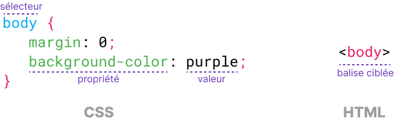
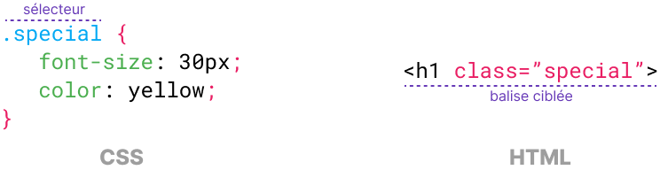

# Le langage CSS

## Introduction

Lors du [précédent TP](tp1-langage-html.md), nous avons utilisé le langage HTML (*HyperText Markup Language*) afin de
définir le **contenu** et la **structure** d'un document web.
Cette fois-ci, l'objectif est de **mettre en forme** un document web déjà existant. Pour cela, nous allons utiliser le
langage CSS (pour *Cascading Style Sheets* ou *feuilles de style en cascade* en français).

!!! success "Objectifs"

    - Savoir le rôle du langage CSS
    - Savoir faire la distinction entre le langage HTML et le langage CSS
    - Comprendre la structure du lmnagage CSS
    - Savoir ce qu'est n selecteur de classe
    - Savoir ce qu'est n selecteur de type
    - Savoir ce qu'est une propriété CSS
    - Savoir ce qu;est un style CSS
    - Savoir compresser et envoyer un dossier au format ZIP


!!! danger "Travail à rendre"

    Les travaux réalisés dans le cadre de ce TP est à rendre en fin de séance selon les modalités suivantes.


## Préparation

### Espace de travail

Vous allez créer des dossiers afin de ne pas mélanger vos productions numériques entre vos différentes matières et
travaux pratiques.

!!! note "Organisation de l'espace travail"

    === ":material-laptop: Ordinateur portable"

        1. Lancez l'**explorateur de fichiers**
        2. Accédez au dossier **Documents**
        3. S'il n'y a pas de dossier nommé **SNT**, créez-le
        4. Entrez dans le dossier **SNT** et créez-y le dossier **web**

    === ":material-desktop-tower: Ordinateur fixe"

        1. Depuis le bureau, double-cliquez sur l'icône intitulée **Zone personnelle**
        2. Dans votre zone personnelle, s'il n'y a pas de dossier nommé **SNT**, créez-le
        4. Entrez dans le dossier **SNT** et créez-y le dossier **web**

### Téléchargement des fichiers

Pour effectuer ce TP, il est nécessaire de télécharger certains fichiers :

!!! note "Récupération des fichiers"

    1. Récupérer l'archive zip contenant les fichiers du TP : [📦 télécharger](assets/SNT02_TP2.zip){:download}
    2. Ouvrir le fichier ZIP (le navigateur l'ouvre automatiquement ou au clic sur le fichier téléchargé)
    3. Sélectionner tous les fichiers et dossiers (++ctrl+a++)
    4. Copier (++ctrl+c++)
    5. Coller les fichiers dans le dossier **SNT/Web/langage_css** (++ctrl+v++)

## Application des styles

### Feuille de style externe

Le document web pour lequel nous allons définir le style réside dans le fichier <FichierHTML />.
L'ensemble du code CSS sera écrit dans un fichier déjà présent et nommé <FichierCSS />.
Ce fichier est une feuille de style dite externe car le code CSS se trouve à l'extérieur du fichier <FichierHTML />.

!!! tip "En savoir plus"
    
    Pour définir nos styles CSS, nous n'utiliserons qu'une seule des trois méthodes possibles :

    - Utiliser l'attribut `style` des balises HTML ([référence](https://developer.mozilla.org/fr/docs/Web/HTML/Global_attributes/style))
    - Utiliser la balise `#!html <style></style>` (*feuille de style interne*) ([référence](https://developer.mozilla.org/fr/docs/Web/HTML/Element/style))
    - Utiliser un lien vers une ressource externe (*feuille de style externe*) ([référence](https://developer.mozilla.org/fr/docs/Web/HTML/Element/link))

!!! note "Ajouter une feuille de style"

    1. Lancez **l'explorateur de fichiers**
    2. Rendez-vous dans le répertoire **SNT\Web\langage_css**
    3. Double-cliquez sur le fichier **index.html** pour qu'il s'ouvre dans un navigateur web
    4. Lancez l'application Bloc Note
    5. Ouvrez le fichier **index.html** depuis Notepad++ (Menu *Fichier > Ouvrir* ou `CTRL+O`)
    6. **Cherchez** les balises `#!html <head> ... </head>`
    7. **Ajoutez** la balise `#!html <link href="style.css" rel="stylesheet">` entre les balises `#!html <head></head>`
    8. Votre code HTML doit maintenant ressembler à ceci :
    ```html
    <head>
        <meta charset="utf-8">
        <title>PMDb - Personal Movie Database</title>
        <link href="style.css" rel="stylesheet">
    </head>
    ```
    9. **Enregistrer** le fichier `CTRL+S`
    10. **Retourner** dans le navigateur web
    11. **Rafraichir** la page (`F5` ou `CTRL+R`). Des changements doivent être observables.

!!! info "Bilan"
    
    Le document web <FichierHTML /> est maintenant relié au fichier <FichierCSS />.
    Le fichier  <FichierCSS /> est appelé **feuille de style**.
    Il contient des instructions en **langage CSS** ayant pour finalité la **mise en forme** le document web.

### Sélecteur de type

Nous allons étudier plus en détail la feuille de style pour identifier le code CSS responsable des changements observés.

!!! note "Observer le langage CSS"

    1. Retourner dans l'application Notepad++
    2. Ouvrir le fichier <FichierCSS />
    3. Vous devez voir en début de fichier du code similaire à celui-ci :
    
    ```css
    body {
        margin: 0;
        background-color: purple;
    }
    
    header {
        background-color: #121212;
        color: white;
        padding: 20px;
    }
    ```

!!! info "Explications"

    Une feuille de styles contient un ensemble de **déclarations**. Chaque déclaration est constituée de deux parties :

    - Un **sélecteur**, qui permet de sélectionner **la balise** de l'élément à mettre en forme
    - Un **ensemble de règles** entre des accolades `{ }`. Les règles permettent d'ajuster des **propriétés** de mise en forme

    <figure markdown>
        
        <figcaption>Exemple de déclaration CSS ciblant la balise </em><code>body</code></figcaption>
    </figure>

    Dans le cas ci-dessus, il est question du **sélecteur** `body`.
    Il s'agit d'un **sélecteur de type**, c'est-à-dire qu'il permet de cibler la balise de type `<body>` qui se verra alors appliquer l'ensemble des règles définies (marge à 0 et couleur de fond à violet).

!!! note "Création d'un style"

    Nous allons déclarer un style CSS dont le sélecteur va cibler le balise `<h1>` correspondant au titre principale de notre document (*« Intouchable »*).

    1. Retourner dans l'application Notepad++
    2. Revenir au fichier <FichierCSS /> (si besoin, Menu *Fichier > Ouvrir* ou `CTRL+O`)
    3. **Ajouter** la déclaration CSS suivante (*vous pouvez l'ajouter n'importe où, mais si vous doutez, ajoutez-la en fin de fichier*) :

    ```css
    h1 {
        color: red;
    }
    ```

    4. **Enregistrer** le fichier `CTRL+S`
    5. Retourner dans le navigateur web
    6. Rafraichir la page (`F5` ou `CTRL+R`), un changement doit être observable au niveau du titre principal

### Sélecteur de classe

Avec le sélecteur de type, il n'est pas possible de choisir précisément l'élément sur lequel nous souhaitons appliquer
un style.
Pour résoudre ce problème, il existe un autre genre de sélecteur.

!!! note "Mise en pratique"

    1. Retourner dans l'application Notepad++
    2. Revenir au fichier <FichierCSS />
    3. **Rechercher** la déclaration CSS ayant pour sélecteur **.logo** :

    ```css
    .logo {
        background-color: #f5c518;
    
        ...
        justify-content: center
    ;
    }
    ```

    Le sélecteur `.logo` ne correspond à aucune balise HTML. Son nom est **précédé d'un point**.
    Ceci signifie qu'il est question d'un **sélecteur de classe**.
    Celui-ci cible les balises dont l'attribut `class` a pour valeur `logo`.

    <figure markdown>
        
        <figcaption>Exemple de déclaration CSS ciblant les balises disposant de la classe </em><code>special</code></figcaption>
    </figure>


!!! note "Application du sélecteur"

    1. Retourner dans l'application Notepad++
    2. Revenir au fichier <FichierHTML />
    3. **Chercher** à proximité de la balise **ouvrante** `<body>` la ligne :
    ```html
    <a href="https://www.imdb.com/video/vi59285529">PMDb</a>
    ```
    4. **Ajouter** l'attribut `class="logo"` à cette balise `<a>`
    5. Votre code HTML doit maintenant ressembler à ceci :
    ```html
    <a class="logo" href="https://www.imdb.com/video/vi59285529">PMDb</a>
    ```
    6. Enregistrer les modifications `CTRL+S`
    7. Retourner dans le navigateur web
    8. Rafraichir la page (`F5` ou `CTRL+R`), un changement doit être observable tout en haut de la page

!!! info "Bilan"

    Pour qu'un style s'applique à une balise, il faut pouvoir la cibler finement.
    Pour cela, nous avons étudié deux sélecteurs :

    - les **sélecteurs de type** qui ciblent un type de balise précis
    - les **sélecteurs de classe** qui ciblent les balises dont l'attribut `class` a une valeur précise


## Propriétés CSS

### Gestion des couleurs

Les propriétés CSS `background-color` et `color` permettent d'ajuster respectivement la **couleur de fond** d'un élément
et la **couleur du texte** contenu par celui-ci.
Pour choisir une couleur, il est possible d'utiliser un **nom** (par exemple `red`) ou un **code hexadécimal** (par
exemple `#ff0000`).

Une liste de noms de couleurs est disponible sur [Wikipédia](https://fr.wikipedia.org/wiki/Couleur_du_Web).
Il est aussi possible d'obtenir le code hexadécimal de n'importe quelle couleur en utilisant
un [outil de gestion des couleurs](https://mdn.github.io/css-examples/tools/color-picker/).

!!! info "Propriétés CSS"

    | Propriété          | Description                         | Référence                                                                 |
    |--------------------|-------------------------------------|---------------------------------------------------------------------------|
    | `background-color` | Couleur d'arrière-plan d'un élément | [Mozilla](https://developer.mozilla.org/fr/docs/Web/CSS/background-color) |
    | `color`            | Couleur du texte d'un élément       | [Mozilla](https://developer.mozilla.org/fr/docs/Web/CSS/color)            |

??? example "Exemple"

    Voici **un exemple** de déclaration CSS permettant de modifier la **couleur de fond** et la **couleur du texte** du
    contenu de la balise `body` (donc de tout le document HTML).
    Le texte entre `/* */` est un commentaire. Les commentaires permettent d'ajouter des précisions sans conséquence sur la
    mise en forme CSS.
    
    ```css
    body {
        background-color: yellow; /* couleur de fond jaune  */
        color: #ffba00; /* couleur du texte jaune */
    }
    ```


!!! note "Mise en pratique"

    1. Retourner dans l'application Notepad++
    2. Revenir au fichier <FichierCSS />
    3. **Modifier** la déclaration CSS ciblant la balise `body` de façon à modifier uniquement la **couleur d'arrière-plan**
      de votre document HTML (*inspirez-vous de l'exemple d'utilisation*)
    4. **Ajouter** une nouvelle déclaration CSS ciblant la balise `h2` de façon à modifier la **couleur du texte** de chaque
      sous-titre (*inspirez-vous de l'exemple d'utilisation et de ce qui a été fait pour* `h1`)

### Gestion du texte

Les propriétés CSS `font-size` et `text-decoration` permettent respectivement d'ajuster la taille du texte et la
décoration du texte (soulignement).

!!! info "Propriétés CSS"

    | Propriété         | Description                  | Référence                                                                |
    |-------------------|------------------------------|--------------------------------------------------------------------------|
    | `font-size`       | Taille du texte d'un élément | [Mozilla](https://developer.mozilla.org/fr/docs/Web/CSS/font-size)       |
    | `text-decoration` | Soulignement d'un élément    | [Mozilla](https://developer.mozilla.org/fr/docs/Web/CSS/text-decoration) |

??? example "Exemple"

    Voici **un exemple** de déclaration permettant de grossir et souligner le texte de toute balise de classe `super` (
    c'est-à-dire ayant l'attribut `class="super"`) :
    
    ```css
    .super {
        font-size: 150px; /* taille en pixels */
        text-decoration: underline; /* soulignement */
    }
    ```

!!! note "Mise en pratique"

    1. Retourner dans l'application Notepad++
    2. Revenir au fichier <FichierCSS />
    3. **Modifier** la déclaration CSS ciblant la balise `h1` de façon à grossir la **taille du texte** du titre principal
    4. **Modifier** la déclaration CSS ciblant la balise `h2` de façon à **souligner** les sous-titres

### Gestion des dimensions

Les propriétés CSS `width` et `height` permettent d'ajuster respectivement la largeur et la hauteur d'un élément.

!!! info "Propriétés CSS"

    | Propriété | Description          | Référence                                                       |
    |-----------|----------------------|-----------------------------------------------------------------|
    | `width`   | Largeur d'un élément | [Mozilla](https://developer.mozilla.org/fr/docs/Web/CSS/width)  |
    | `height`  | Hauteur d'un élément | [Mozilla](https://developer.mozilla.org/fr/docs/Web/CSS/height) |

??? example "Exemple"

    Voici ci-dessous un exemple de déclaration CSS permettant de fixer la largeur de tout élément de classe `icone` à 10
    pixels de large:
    
    ```css
    .icone {
        width: 10px; /* largeur de l'élément en pixels */
    }
    ```


#### <PracticeTitle />

1. Retourner dans l'application Notepad++
2. Revenir au fichier <FichierCSS />
3. **Ajouter** une déclaration CSS permettant de fixer la largeur (`width`) de tout élément de classe `affiche` à 150
   pixels de large.

<details>
    <summary>💡 Solution</summary>

Pour cela vous devez utiliser le sélecteur de classe `.affiche` et fixer la propriété `width` à `150px`.

```css
.affiche {
    width: 150px;
}
```

</details>

4. Enregistrer le fichier `CTRL+S`
5. Revenir au fichier <FichierHTML />
6. **Rechercher** la seule balise `` présente dans le document et qui correspond à l'élément **image** de l'affiche
   du film
7. **Modifier** la balise pour lui ajouter la classe `affiche`


!!! success "Solution"
   
    Après modification, le code HTML de la balise `img` doit être similaire à ceci :

    ```html
    
    ```


8. **Enregistrer** le fichier `CTRL+S`
9. Retourner dans le navigateur web
10. Rafraichir la page, un changement doit être observable au niveau de l'affiche du film

### Expérimentation

Vous avez terminé et il reste plus de 5 minutes avant la fin de la séance ? Bravo !
Il vous reste encore beaucoup à découvrir et d'autres propriétés peuvent se révéler intéressantes :

| Propriété          | Description                       | Référence                                                                 |
|--------------------|-----------------------------------|---------------------------------------------------------------------------|
| `text-align`       | Alignement du texte               | [Mozilla](https://developer.mozilla.org/fr/docs/Web/CSS/text-align)       |
| `border`           | Bordure autour d'un élément       | [Mozilla](https://developer.mozilla.org/fr/docs/Web/CSS/border)           |
| `margin-bottom`    | Marge inférieure d'un élément     | [Mozilla](https://developer.mozilla.org/fr/docs/Web/CSS/margin-bottom)    |
| `background-image` | Image d'arrière-plan d'un élément | [Mozilla](https://developer.mozilla.org/fr/docs/Web/CSS/background-image) |

#### <PracticeTitle />

Tester chacune de ces propriétés. Ne pas hésiter à s'inspirer des exemples interactifs présentés sur les pages de
référence.

## Envoi du travail

### Création du fichier ZIP

Pour faciliter le partage de plusieurs fichiers et dossiers, il est de regrouper l'ensemble dans un seul fichier au
format ZIP.
Lire les instructions selon l'ordinateur utilisés :

<details>
    <summary>💻 Ordinateur portable (Windows 11)</summary>

1. Lancer <FileExplorer />
2. Se rendre dans le dossier `SNT\Web`
3. Cliquer une seule fois avec le bouton **gauche** sur le dossier `langage_css` pour le sélectionner
4. Cliquer avec le bouton **droit** sur le dossier `langage_css`
5. Choisir l'option **Compresser dans le fichier ZIP**
6. Nommer le fichier *nom*_*prenom*_tp_css.zip

</details>

<details>
    <summary>🖥 Ordinateur fixe des salles informatiques (Windows 10)</summary>

1. Lancer <FileExplorer />
2. Se rendre dans le dossier `SNT\Web`
3. Cliquer une seule fois avec le bouton **gauche** sur le dossier `langage_css` pour le sélectionner
4. Cliquer avec le bouton **droit** sur le dossier `langage_css`
5. Choisir l'option **Envoyer vers** puis **Dossier compressé**
6. Nommer le fichier *nom*_*prenom*_tp_css.zip

</details>

### Transmission du fichier ZIP

1. Se connecter à l'ENT
2. Accéder à l'application **Exercices**
3. Cliquer sur l'exercice **[2TP2] Le langage CSS - Rendu**
4. Choisir le fichier ZIP créé précédemment pour envoi
5. Valider l'envoi du devoir